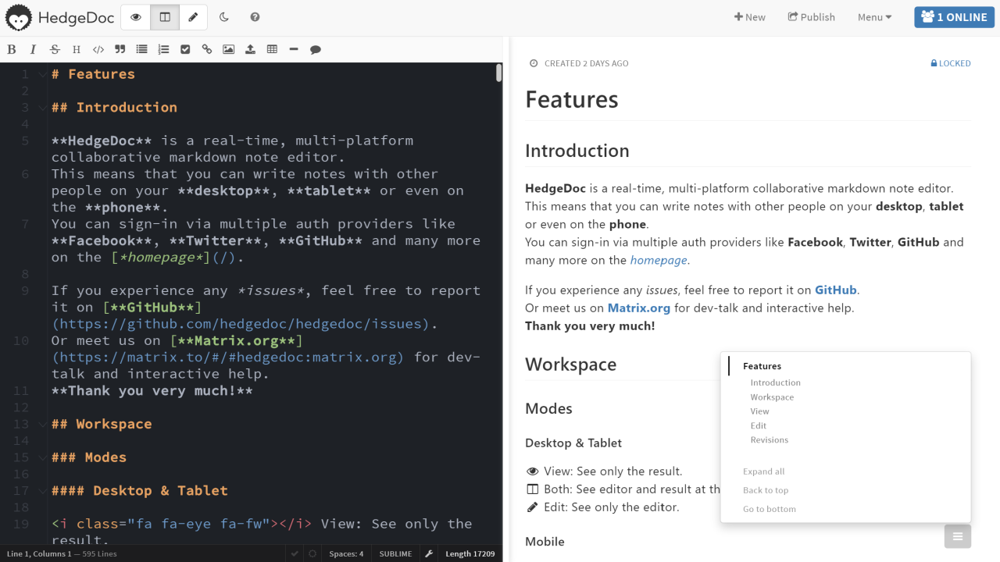

<!--
N.B.: This README was automatically generated by https://github.com/YunoHost/apps/tree/master/tools/README-generator
It shall NOT be edited by hand.
-->

# HedgeDoc for YunoHost

[](https://dash.yunohost.org/appci/app/hedgedoc)    
[](https://install-app.yunohost.org/?app=hedgedoc)

*[Lire ce readme en français.](./README_fr.md)*

> *This package allows you to install HedgeDoc quickly and simply on a YunoHost server.
If you don't have YunoHost, please consult [the guide](https://yunohost.org/#/install) to learn how to install it.*

## Overview

Collaborative editor to work on notes written in Markdown

**Shipped version:** 1.9.0~ynh1

**Demo:** https://demo.hedgedoc.org/

## Screenshots



## Disclaimers / important information

## Configuration

You can configure HedgeDoc by editing this file `/var/www/hedgedoc/config.json` using the [documentation](https://github.com/hedgedoc/hedgedoc/blob/master/docs/configuration.md)  
When you finished editing the configuration, for your changes to take effect, you will have to run: `sudo systemctl restart hedgedoc`.

## Documentation and resources

* Official app website: https://hedgedoc.org
* Official user documentation: https://yunohost.org/en/app_hedgedoc
* Official admin documentation: https://docs.hedgedoc.org/
* Upstream app code repository: https://github.com/hedgedoc/hedgedoc
* YunoHost documentation for this app: https://yunohost.org/app_hedgedoc
* Report a bug: https://github.com/YunoHost-Apps/hedgedoc_ynh/issues

## Developer info

Please send your pull request to the [testing branch](https://github.com/YunoHost-Apps/hedgedoc_ynh/tree/testing).

To try the testing branch, please proceed like that.
```
sudo yunohost app install https://github.com/YunoHost-Apps/hedgedoc_ynh/tree/testing --debug
or
sudo yunohost app upgrade hedgedoc -u https://github.com/YunoHost-Apps/hedgedoc_ynh/tree/testing --debug
```

**More info regarding app packaging:** https://yunohost.org/packaging_apps