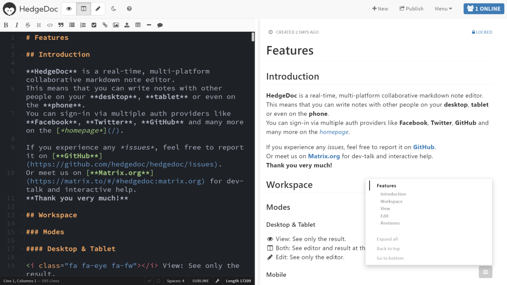

<!--
Важно: этот README был автоматически сгенерирован <https://github.com/YunoHost/apps/tree/master/tools/readme_generator>
Он НЕ ДОЛЖЕН редактироваться вручную.
-->

# HedgeDoc для YunoHost

[](https://ci-apps.yunohost.org/ci/apps/hedgedoc/)


[](https://install-app.yunohost.org/?app=hedgedoc)

*[Прочтите этот README на других языках.](./ALL_README.md)*

> *Этот пакет позволяет Вам установить HedgeDoc быстро и просто на YunoHost-сервер.*  
> *Если у Вас нет YunoHost, пожалуйста, посмотрите [инструкцию](https://yunohost.org/install), чтобы узнать, как установить его.*

## Обзор

HedgeDoc (formerly known as CodiMD) is an open-source, web-based, self-hosted, collaborative markdown editor.
You can use it to easily collaborate on notes, graphs and even presentations in real-time. All you need to do is to share your note-link to your co-workers and they’re ready to go.

### Features

- Real-time collaboration
- Graphs & diagrams
- Revisions
- Presentation mode
- Easy to use permission system
- Low system requirements


**Поставляемая версия:** 1.10.0~ynh1

**Демо-версия:** <https://demo.hedgedoc.org/>

## Снимки экрана



## Документация и ресурсы

- Официальный веб-сайт приложения: <https://hedgedoc.org>
- Официальная документация администратора: <https://docs.hedgedoc.org/>
- Репозиторий кода главной ветки приложения: <https://github.com/hedgedoc/hedgedoc>
- Магазин YunoHost: <https://apps.yunohost.org/app/hedgedoc>
- Сообщите об ошибке: <https://github.com/YunoHost-Apps/hedgedoc_ynh/issues>

## Информация для разработчиков

Пришлите Ваш запрос на слияние в [ветку `testing`](https://github.com/YunoHost-Apps/hedgedoc_ynh/tree/testing).

Чтобы попробовать ветку `testing`, пожалуйста, сделайте что-то вроде этого:

```bash
sudo yunohost app install https://github.com/YunoHost-Apps/hedgedoc_ynh/tree/testing --debug
или
sudo yunohost app upgrade hedgedoc -u https://github.com/YunoHost-Apps/hedgedoc_ynh/tree/testing --debug
```

**Больше информации о пакетировании приложений:** <https://yunohost.org/packaging_apps>
